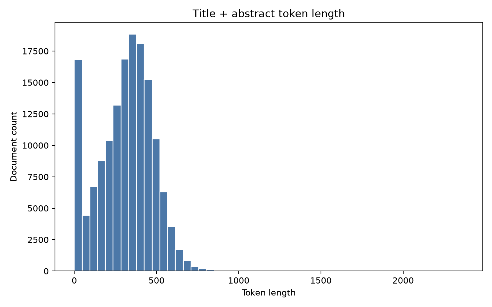
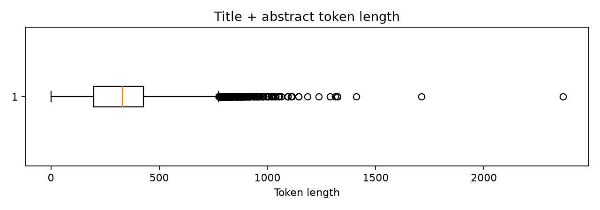
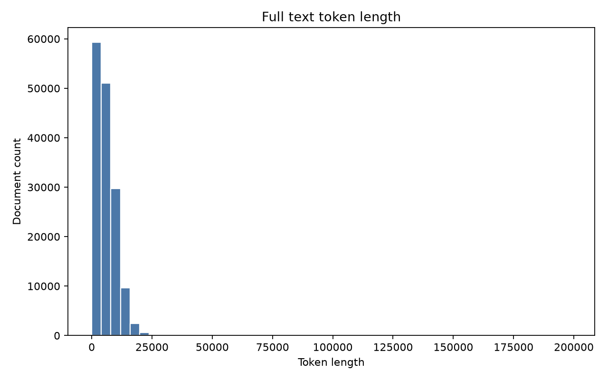
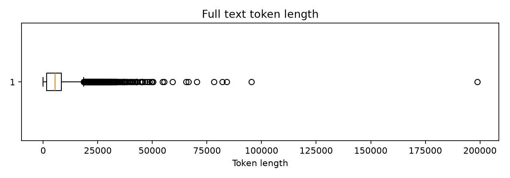

# RAG数据分析与设计说明（153121篇 PMC OA）

## 1. 任务背景与目标

本阶段任务是面向医学专业知识生成 LLM 的 RAG 系统做数据加载、数据评估和文本分割策略设计。mentor 反馈原先 `3028` 篇样本规模偏小，因此本轮将分析范围扩展到本地已下载的 `153121` 篇 PMC OA `oa_comm/xml` 文献，重新完成字段完整性、基础质量、metadata 可用性、医学领域语言特征、token 长度分布和文本分割策略分析。

本报告对应的正式产物前缀为 `limit153121`。核心脚本和输出包括：

```text
scripts/10_analyze_oa_comm_153121.py
scripts/10_resume_oa_comm_153121.py
reports/formal/RAG数据分析与设计说明_limit153121.md
artifacts/metrics/t006_fullscale_analysis/pmc_records_light_limit153121.csv
artifacts/metrics/t006_fullscale_analysis/fullscale_analysis_summary_limit153121.csv
reports/samples/fulltext_stratified_sample_for_review_limit153121.md
```

## 2. 数据来源与加载方式

数据来源为 NCBI PMC OA Bulk deprecated 目录下的 `oa_comm/xml`：

```text
https://ftp.ncbi.nlm.nih.gov/pub/pmc/deprecated/oa_bulk/oa_comm/xml/
```

本地数据目录：

```text
data/raw/pmc_oa_comm
```

本轮直接分析本地三片 XML 数据：

| 数据片 | XML 数 |
|---|---:|
| PMC000xxxxxx | 3028 |
| PMC001xxxxxx | 27518 |
| PMC002xxxxxx | 122575 |
| 合计 | 153121 |

实际处理结果：

| 指标 | 数值 |
|---|---:|
| 目标 XML 数 | 153121 |
| 实际选择 XML 数 | 153121 |
| 解析成功 | 153121 |
| 解析失败 | 0 |
| 轻量全量表记录数 | 153121 |

核心输出文件：

```text
artifacts/metrics/t006_fullscale_analysis/parse_summary_limit153121.csv
artifacts/metrics/t006_fullscale_analysis/pmc_records_light_limit153121.csv
artifacts/metrics/t006_fullscale_analysis/fullscale_analysis_summary_limit153121.csv
logs/10_resume_oa_comm_limit153121.log
```

## 3. 数据规模与字段结构

本轮每篇 XML 文献被解析为面向分析的轻量记录。主要字段如下：

| 字段 | 作用 |
|---|---|
| record_id | 本轮处理生成的内部记录 ID |
| doc_id | 优先使用 PMID，否则使用 PMCID 等追溯 ID |
| source_file | 本地 XML 文件路径，用于溯源和调试 |
| title | 检索文本增强和结果展示 |
| journal | 后续按期刊过滤的 metadata |
| pub_date / pub_year | 后续按年份或时间范围过滤的 metadata |
| pmid | PubMed 原文追溯和 citation |
| pmcid | PMC 原文追溯和 citation |
| article_type | 区分 research article、review、case report 等类型 |
| title_abstract_token_len | `title + abstract` 的 tokenizer 长度 |
| full_token_len | `title + abstract + body` 的 tokenizer 长度 |
| quality_decision | 基础质量标记 |
| section_title_count | 正文 XML section title 数量 |
| recommended_split_strategy | 本轮推荐的全文分割路由 |

轻量表路径：

```text
artifacts/metrics/t006_fullscale_analysis/pmc_records_light_limit153121.csv
```

需要注意：轻量表中的 `full_token_len` 是对全文内容计算后的长度统计，但表内不保存全文本身。这样既保留了分析指标，也避免了不必要的磁盘膨胀。

## 4. 字段完整性分析

字段缺失统计如下：

| 字段 | 非空数量 | 缺失数量 | 缺失率 |
|---|---:|---:|---:|
| title | 153101 | 20 | 0.01% |
| abstract | 138489 | 14632 | 9.56% |
| body | 133539 | 19582 | 12.79% |
| journal | 153121 | 0 | 0.00% |
| pub_date | 153121 | 0 | 0.00% |
| pub_year | 153121 | 0 | 0.00% |
| pmid | 147551 | 5570 | 3.64% |
| pmcid | 153121 | 0 | 0.00% |
| article_type | 153121 | 0 | 0.00% |

`abstract` 缺失率为 `9.56%`，高于 1%，不能简单忽略。与 3028 小样本相比，15w 数据中还出现了 `body` 缺失，缺失率为 `12.79%`。因此，后续 RAG 数据构建需要区分摘要级和全文级可用性。

对应结果表：

```text
artifacts/metrics/t006_fullscale_analysis/missing_rate_limit153121.csv
```

清洗策略建议：

| 情况 | 策略 | 原因 |
|---|---|---|
| title 存在 | 保留并拼接到检索文本前部 | title 提供主题上下文 |
| title 缺失 | 保留正文或摘要，但结果展示时用 PMCID/source_file 兜底 | 仅 20 篇缺失，不应因此丢弃正文 |
| abstract 存在 | 摘要级 RAG 使用 `title + abstract` | 信息密度高，长度相对可控 |
| abstract 缺失但 body 存在 | 保留到全文级流程，后续可用 introduction 或正文前段增强 | 避免丢弃 14632 篇文献 |
| body 存在 | 进入全文级 RAG 候选 | 全文 RAG 的主要来源 |
| body 缺失但 title/abstract 存在 | 只进入摘要级 RAG 或短文档流程 | 无法做章节级全文切分 |
| title、abstract、body 均缺失 | 标记为 `drop_no_text` | 无可检索文本 |
| pmid 缺失 | 使用 pmcid/source_file 作为追溯 fallback | pmcid 当前 100% 可用 |

## 5. 基础质量分析

基础质量统计如下：

| 指标 | 数值 |
|---|---:|
| 总记录数 | 153121 |
| 空 title | 20 |
| 空 abstract | 14632 |
| 空 body | 19582 |
| 重复 pmid | 32 |
| 重复 pmcid | 0 |
| quality_decision = keep | 123356 |
| quality_decision = keep_with_warning | 24278 |
| quality_decision = need_review | 5472 |
| quality_decision = drop_no_text | 15 |

质量标记占比如下：

| quality_decision | 文献数 | 比例 |
|---|---:|---:|
| keep | 123356 | 80.56% |
| keep_with_warning | 24278 | 15.86% |
| need_review | 5472 | 3.57% |
| drop_no_text | 15 | 0.01% |

质量结论：

- `keep` 占 80.56%，大部分文献具备较完整的标题、摘要或正文。
- `keep_with_warning` 主要来自 abstract 缺失、过短或正文可用性不足等情况，不建议直接丢弃。
- `need_review` 占 3.57%，可在后续 chunk 生成时保留质量标记，便于抽样检查。
- `drop_no_text` 只有 15 篇，后续正式 chunk 数据集可以排除。
- `pmcid` 没有重复，适合作为稳定追溯字段；`pmid` 有少量重复或缺失，不能作为唯一主键。

对应结果表：

```text
artifacts/metrics/t006_fullscale_analysis/quality_summary_limit153121.csv
```

对 RAG 的影响：

- 摘要级库可优先使用 `keep` 样本。
- `keep_with_warning` 可以保留，但需要在 metadata 中记录质量标记。
- `need_review` 样本不应在分析阶段删除，后续可通过质量抽样确定是否进入正式库。
- `drop_no_text` 没有可检索文本，实际 chunk 生成时应排除。

## 6. Metadata 可用性分析

metadata 可用率如下：

| 字段 | 可用率 | 后续用途 | 建议 |
|---|---:|---|---|
| title | 99.99% | 检索文本增强、结果展示 | 保留 |
| journal | 100.00% | 期刊 metadata filter | 保留 |
| pub_year | 100.00% | 年份 metadata filter | 保留 |
| pmid | 96.36% | PubMed 原文追溯 | 保留，但不能作为唯一主键 |
| pmcid | 100.00% | PMC 原文追溯 | 保留，优先作为追溯 ID |
| source_file | 100.00% | 本地溯源和调试 | 保留 |

对应结果表：

```text
artifacts/metrics/t006_fullscale_analysis/metadata_summary_limit153121.csv
```

Top journal 分布：

| journal | 文献数 | 比例 |
|---|---:|---:|
| British Journal of Cancer | 19946 | 13.03% |
| PLoS ONE | 14937 | 9.76% |
| Acta Crystallographica Section E: Structure Reports Online | 9204 | 6.01% |
| BMC Bioinformatics | 3594 | 2.35% |
| Environmental Health Perspectives | 3567 | 2.33% |
| BMC Genomics | 2944 | 1.92% |
| Emerging Infectious Diseases | 2841 | 1.86% |
| PLoS Biology | 2522 | 1.65% |
| BMC Public Health | 2458 | 1.61% |
| BMC Cancer | 2220 | 1.45% |

Top publication year 分布：

| pub_year | 文献数 | 比例 |
|---|---:|---:|
| 2010 | 33777 | 22.06% |
| 2009 | 33718 | 22.02% |
| 2008 | 26298 | 17.17% |
| 2007 | 15467 | 10.10% |
| 2006 | 10957 | 7.16% |
| 2005 | 7732 | 5.05% |
| 2004 | 3841 | 2.51% |
| 2003 | 1421 | 0.93% |
| 1999 | 1323 | 0.86% |
| 2002 | 1269 | 0.83% |

Article type 分布：

| article_type | 文献数 | 比例 |
|---|---:|---:|
| research-article | 125231 | 81.79% |
| review-article | 6484 | 4.23% |
| other | 6076 | 3.97% |
| case-report | 3079 | 2.01% |
| letter | 2669 | 1.74% |
| editorial | 1714 | 1.12% |
| correction | 1254 | 0.82% |
| book-review | 1225 | 0.80% |
| brief-report | 1178 | 0.77% |
| news | 1093 | 0.71% |

metadata 结论：

- 当前 15w 数据已经支持后续实现按 `journal`、`pub_year`、`article_type` 等字段过滤。
- `pub_year` 分布集中在 2005-2010，说明这批 deprecated baseline 适合做方法验证和系统链路建设，但不能代表最新医学文献。
- `pmcid` 100% 可用，应作为 citation/source tracking 的主追溯字段。
- `pmid` 可用率为 96.36%，有 PMID 时可补充 PubMed 链接；缺失时用 PMCID。

## 7. 领域语言特性分析

本轮领域内容理解基于全文解析后的轻量统计和分层抽样，不只看摘要。抽样阅读文件为：

```text
reports/samples/fulltext_stratified_sample_for_review_limit153121.md
artifacts/metrics/t006_fullscale_analysis/fulltext_domain_sample_summary_limit153121.csv
```

抽样覆盖 short、medium、long 三个 `full_token_len` 区间，用于观察医学文本的信息密度、章节结构、术语缩写和后续 prompt 设计风险。

### 7.1 正文结构特点

全文结构统计：

| 指标 | 数值 |
|---|---:|
| 总文献数 | 153121 |
| 有任意正文 section title 的文献 | 125852 |
| section title 覆盖率 | 82.19% |
| IMRaD core 文献数 | 79546 |
| IMRaD core 比例 | 51.95% |
| 含 Conclusion/Summary 的 IMRaD 比例 | 32.43% |
| section title 数量均值 | 11.60 |
| section title 数量中位数 | 11 |
| section title 数量 p95 | 26 |
| section title 数量最大值 | 253 |

常见正文 section title：

| section title | 出现次数 |
|---|---:|
| discussion | 85357 |
| results | 78815 |
| authors' contributions | 57064 |
| methods | 53300 |
| background | 51776 |
| conclusion | 44912 |
| introduction | 43766 |
| competing interests | 43225 |
| materials and methods | 30296 |
| supplementary material | 25694 |
| statistical analysis | 19755 |
| conclusions | 16160 |
| pre-publication history | 15678 |
| supporting information | 13944 |
| abbreviations | 13295 |

对应结果表：

```text
artifacts/metrics/t006_fullscale_analysis/full_text_section_analysis_light_limit153121.csv
artifacts/metrics/t006_fullscale_analysis/full_text_section_title_top80_limit153121.csv
```

结论是：15w 文献中多数正文具有可利用的 XML section title，但结构并不完全等同于标准 Introduction / Methods / Results / Discussion。后续语义章节分割需要兼容 Background、Materials and methods、Results and discussion、Conclusion、Summary、Case presentation、Statistical analysis 等变体。

### 7.2 摘要结构化标记

摘要中结构化标记统计如下：

| 标记 | 数量 | 比例 |
|---|---:|---:|
| BACKGROUND | 63162 | 41.25% |
| OBJECTIVE | 6798 | 4.44% |
| METHODS | 45438 | 29.67% |
| RESULTS | 73936 | 48.29% |
| CONCLUSIONS | 23826 | 15.56% |
| INTRODUCTION | 5930 | 3.87% |
| DISCUSSION | 3170 | 2.07% |

对应结果表：

```text
artifacts/metrics/t006_fullscale_analysis/structured_abstract_markers_limit153121.csv
```

这说明摘要中也存在明显结构化信号，但覆盖率不如正文 section title 稳定。摘要级切分不能只依赖大写结构标记；更稳妥的做法是按 token 长度判断，短摘要整体保留，长摘要再用滑动窗口兜底。

### 7.3 术语、缩写与高频词

全文高频 unigram：

| term | count |
|---|---:|
| cells | 1696163 |
| data | 1352632 |
| patients | 1138683 |
| cell | 977460 |
| expression | 976870 |
| analysis | 903142 |
| genes | 849569 |
| gene | 805030 |
| protein | 760655 |
| both | 734934 |
| only | 666775 |
| different | 652666 |
| time | 578945 |
| treatment | 571512 |
| group | 556482 |

全文 top 缩写：

| 缩写 | 次数 |
|---|---:|
| DNA | 416075 |
| PCR | 233934 |
| RNA | 229474 |
| II | 156397 |
| CI | 147073 |
| HIV | 123178 |
| SD | 93264 |
| S1 | 91749 |
| CA | 90497 |
| PBS | 82240 |
| OR | 77932 |
| CD4 | 76510 |
| GFP | 76175 |
| III | 75812 |
| MB | 66414 |

对应结果表：

```text
artifacts/metrics/t006_fullscale_analysis/fulltext_high_freq_unigrams_limit153121.csv
artifacts/metrics/t006_fullscale_analysis/fulltext_abbreviation_top80_limit153121.csv
```

本轮为避免 15w 全文 bigram/trigram Counter 长尾导致运行极慢，正式全量报告采用轻量 lexical pass：保留全量 unigram、缩写、section title 和结构化摘要标记；不把全量 bigram/trigram 作为正式指标。相关占位文件记录了这个边界：

```text
artifacts/metrics/t006_fullscale_analysis/fulltext_high_freq_bigrams_limit153121.csv
artifacts/metrics/t006_fullscale_analysis/fulltext_high_freq_trigrams_limit153121.csv
artifacts/metrics/t006_fullscale_analysis/fulltext_concept_variants_summary_limit153121.csv
```

领域语言特点可以概括为：

- 缩写密度高，包含疾病、基因、蛋白、检测方法和统计术语。
- 同一概念可能存在缩写、全称、连字符写法和近义表达，例如 HIV/AIDS/human immunodeficiency virus、PCR/polymerase chain reaction。
- 文本信息密度高，一句话中常同时包含研究对象、干预、检测指标、统计量和限定条件。
- 后续 query rewrite 应支持缩写和全称双向扩展。
- prompt 应要求保留原始医学术语、数值、比较关系和限定条件。
- 回答应携带 PMCID/PMID 或 source_file，支持 citation/source tracking。

## 8. Token 长度分布分析

本轮使用 `sentence-transformers/all-MiniLM-L6-v2` 对应 tokenizer 统计 token 长度，并以 512 tokens 作为 embedding 输入上限参考。

长度统计结果表：

```text
artifacts/metrics/t006_fullscale_analysis/token_length_records_light_limit153121.csv
artifacts/metrics/t006_fullscale_analysis/token_length_stats_limit153121.csv
```

### 8.1 title + abstract

| 指标 | 数值 |
|---|---:|
| count | 153121 |
| mean | 310.69 |
| median | 330 |
| min | 0 |
| max | 2366 |
| p75 | 428 |
| p90 | 509 |
| p95 | 560 |
| p99 | 667 |
| 超过 512 tokens | 14735 |
| 超过 512 比例 | 9.62% |
| 超过 1024 tokens | 24 |
| 超过 1024 比例 | 0.02% |

结论：`title + abstract` 大部分较短，但仍有约 9.62% 超过 512 tokens。摘要级 RAG 不能完全无脑整体入库，应对长尾摘要做切分。

图 1 展示 `title + abstract` token 长度分布：



图 2 展示 `title + abstract` token 长度箱线图：



### 8.2 full text

| 指标 | 数值 |
|---|---:|
| count | 153121 |
| mean | 5658.86 |
| median | 5374 |
| min | 0 |
| max | 198807 |
| p75 | 8364 |
| p90 | 11433 |
| p95 | 13549 |
| p99 | 18364 |
| 超过 512 tokens | 132157 |
| 超过 512 比例 | 86.31% |
| 超过 1024 tokens | 118444 |
| 超过 1024 比例 | 77.35% |

结论：全文普遍超过 embedding 输入上限，不能整体入库。由于 82.19% 文献有正文 section title，全文处理应优先按语义章节切分；没有章节结构的长文档再使用重叠滑动窗口兜底。

图 3 展示全文 token 长度分布：



图 4 展示全文 token 长度箱线图：



## 9. 文本分割策略设计

mentor 给出的三类策略不是全局三选一，而是根据文献长度和结构进行条件路由：

| 策略 | 适用条件 | 优点 | 缺点 |
|---|---|---|---|
| 整体不分割 | 文本短于 embedding 上限 | 上下文完整，实现简单 | 超长文本会截断或报错 |
| 重叠滑动窗口 | 有长尾文本或无章节结构 | 稳定控制 chunk 长度 | 可能切断语义，引入重复 |
| 语义章节分割 | 正文有明确章节标题 | 保留论文结构，metadata 更清晰 | 依赖 XML 结构，超长章节仍需二次切分 |

### 9.1 摘要级分割策略

对 `title + abstract`：

| 策略 | 条件 | 文献数 | 比例 |
|---|---|---:|---:|
| 整体不分割 | <= 512 tokens | 138386 | 90.38% |
| 重叠滑动窗口 | > 512 tokens | 14735 | 9.62% |

建议：摘要级 RAG 使用 `title + abstract`，其中 90.38% 可整体入库；超过 512 tokens 的长尾摘要使用 `RecursiveCharacterTextSplitter` 切分。

### 9.2 全文分割策略

对 `text_full`：

| 策略 | 条件 | 文献数 | 比例 | 估算 chunks |
|---|---|---:|---:|---:|
| 整体不分割 | full text <= 512 tokens | 20964 | 13.69% | 23673 |
| 语义章节优先 | full text > 512 且 XML 有 section title | 125562 | 82.00% | 2700414 |
| 重叠滑动窗口兜底 | full text > 512 且无 section title | 6595 | 4.31% | 26373 |
| 合计 | - | 153121 | 100.00% | 2750460 |

全文分割策略：

```text
whole_document_under_512:
  20964 篇短文档整体保留

semantic_section:
  125562 篇按 XML 章节切分，保留 section_title metadata

recursive_fallback_no_section:
  6595 篇无明确章节标题，使用 RecursiveCharacterTextSplitter 兜底
```

建议参数：

```text
chunk_size = 400
chunk_overlap = 80
whole_doc_token_limit = 512
embedding model = sentence-transformers/all-MiniLM-L6-v2
```

选择理由：

- 400 tokens 能控制在 all-MiniLM 的 512 tokens 限制内。
- 80 tokens overlap 有助于缓解跨句、跨段信息割裂。
- 章节优先能保留医学论文的 Background、Methods、Results、Discussion、Conclusion 等结构。
- 无章节样本用滑动窗口兜底，保证所有可用文献都能处理。
- 对超长章节，下周实际 chunk 阶段应先按章节形成语义单元，再对超长章节做 recursive split。

切分策略结果表：

```text
artifacts/metrics/t006_fullscale_analysis/full_text_split_strategy_summary_limit153121.csv
```

## 10. 当前阶段结论

本阶段已完成以下工作：

1. 成功解析 `153121` 篇 PMC OA `oa_comm/xml` 文献，失败数为 0。
2. 生成 15w 轻量全量表，不保存全文大字段，保留统计和策略字段。
3. 完成字段完整性、缺失率、基础质量和 metadata 可用性分析。
4. 确认 `journal`、`pub_year`、`pmcid`、`source_file` 适合作为 RAG metadata。
5. 确认 `abstract` 缺失率为 9.56%，需要正文或 introduction 兜底策略。
6. 确认 `body` 缺失率为 12.79%，后续需区分摘要级和全文级可用样本。
7. 完成摘要和全文 token 长度分析，确认全文通常必须切分。
8. 完成医学全文领域语言分析，包括结构、缩写、高频术语和抽样阅读。
9. 制定条件路由式文本分割策略：短文整体不分割、结构清晰长文按语义章节、无章节长文使用重叠滑动窗口兜底。
10. 明确本轮不生成 chunk、不做 Chroma、不生成 PDF；实际文本块数据集属于下周任务。

初始 RAG 数据构造建议：

| 层级 | 文本 | 策略 |
|---|---|---|
| 摘要级 RAG | title + abstract | 138386 篇整体，14735 篇滑动窗口 |
| 全文 RAG | title + abstract + body | 20964 篇整体，125562 篇章节优先，6595 篇滑动窗口兜底 |
| metadata | journal, pub_year, pmid, pmcid, source_file, article_type, section_title, quality_decision | 用于过滤、追溯、citation 和质量调试 |

## 13. 关键产物路径

```text
reports/formal/RAG数据分析与设计说明_limit153121.md
artifacts/metrics/t006_fullscale_analysis/parse_summary_limit153121.csv
artifacts/metrics/t006_fullscale_analysis/pmc_records_light_limit153121.csv
artifacts/metrics/t006_fullscale_analysis/fullscale_analysis_summary_limit153121.csv
artifacts/metrics/t006_fullscale_analysis/missing_rate_limit153121.csv
artifacts/metrics/t006_fullscale_analysis/quality_summary_limit153121.csv
artifacts/metrics/t006_fullscale_analysis/metadata_summary_limit153121.csv
artifacts/metrics/t006_fullscale_analysis/token_length_stats_limit153121.csv
artifacts/metrics/t006_fullscale_analysis/token_length_records_light_limit153121.csv
artifacts/metrics/t006_fullscale_analysis/full_text_split_strategy_summary_limit153121.csv
artifacts/metrics/t006_fullscale_analysis/full_text_section_analysis_light_limit153121.csv
artifacts/metrics/t006_fullscale_analysis/full_text_section_title_top80_limit153121.csv
artifacts/metrics/t006_fullscale_analysis/structured_abstract_markers_limit153121.csv
artifacts/metrics/t006_fullscale_analysis/fulltext_high_freq_unigrams_limit153121.csv
artifacts/metrics/t006_fullscale_analysis/fulltext_abbreviation_top80_limit153121.csv
artifacts/metrics/t006_fullscale_analysis/fulltext_domain_sample_summary_limit153121.csv
reports/samples/fulltext_stratified_sample_for_review_limit153121.md
reports/figures/title_abstract_token_length_hist_limit153121.png
reports/figures/title_abstract_token_length_box_limit153121.png
reports/figures/full_text_token_length_hist_limit153121.png
reports/figures/full_text_token_length_box_limit153121.png
```

## 14. 验证结论

| 验证项 | 结果 |
|---|---|
| XML 总数 | 153121 |
| 解析成功 + 解析失败 | 153121 |
| 轻量全量表行数 | 153122 行，表头 + 153121 记录 |
| 字段缺失统计 | 已生成 |
| token 长度统计 | 已生成 |
| section / IMRaD 统计 | 已生成 |
| 高频 unigram / 缩写统计 | 已生成 |
| 图表 PNG | 已生成 |
| 正式 Markdown 报告 | 已生成 |
| chunk dataset | 未生成 |
| Chroma | 未生成 |
| PDF | 未生成 |

