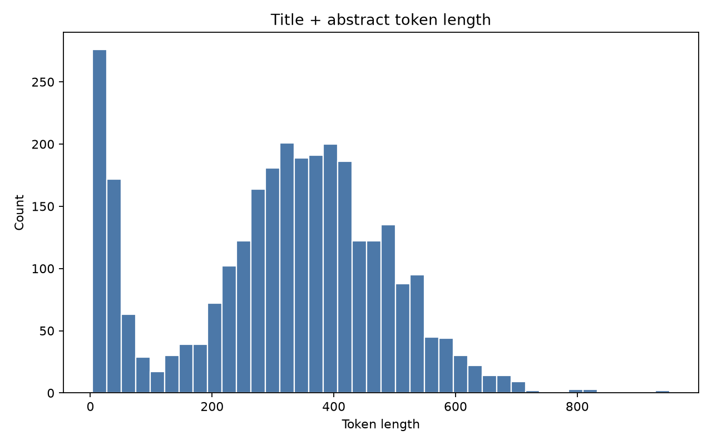
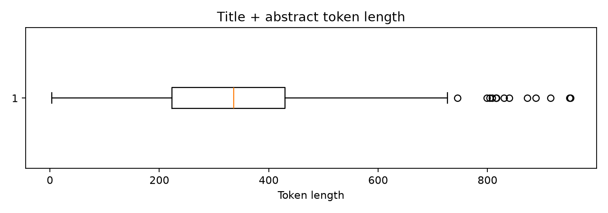
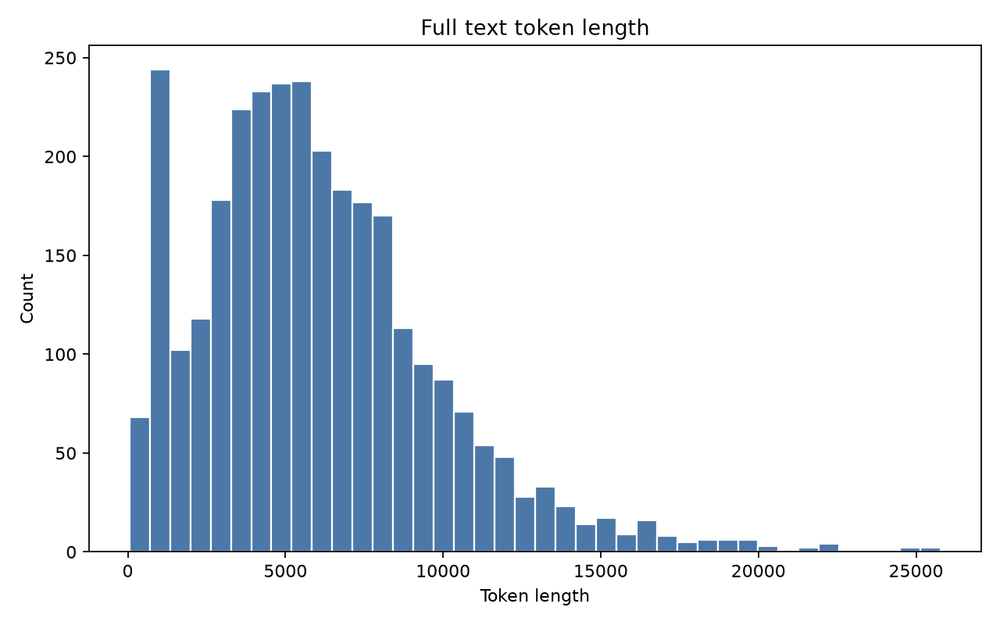

# RAG数据分析与设计说明

## 1. 任务背景与目标

本阶段任务是面向医学专业知识生成 LLM 的 RAG 系统做数据加载与评估准备，重点不是训练模型，也不是开发完整问答系统，而是确认 PMC OA `oa_comm/xml` 文献能否被稳定解析、清洗、切分、向量化并用于后续检索增强生成。

本报告基于本地已下载的 PMC OA Bulk `oa_comm/xml` 小样本，共 `3028` 篇 XML 文献。分析范围覆盖字段完整性、基础质量、metadata 可用性、医学领域语言特征、token 长度分布、文本分割策略，并额外完成了全文 routed chunk + all-MiniLM Chroma 规模验证。

本报告引用的阶段性说明文档包括：

```text
reports/technical/02_field_quality_strategy_notes_limit3028.md
reports/technical/03_token_length_strategy_notes_limit3028.md
reports/technical/04b_fulltext_domain_understanding_limit3028.md
reports/technical/06_full_text_split_strategy_notes_limit3028.md
reports/technical/08_fulltext_chroma_routed_minilm_report_limit3028_routed_minilm.md
```

## 2. 数据来源与加载方式

数据来源为 NCBI PMC OA Bulk deprecated 目录下的 `oa_comm/xml`：

```text
https://ftp.ncbi.nlm.nih.gov/pub/pmc/deprecated/oa_bulk/oa_comm/xml/
```

实际处理结果：

| 指标 | 数值 |
|---|---:|
| 目标 XML 数 | 3028 |
| 实际选择 XML 数 | 3028 |
| 解析成功 | 3028 |
| 解析失败 | 0 |
| Dataset 行数 | 3028 |

核心输出文件：

```text
artifacts/datasets/records/pmc_records_limit3028.csv
artifacts/datasets/records/pmc_records_limit3028.jsonl
artifacts/metrics/t002_corpus_analysis/parse_summary_limit3028.csv
reports/technical/01_parse_strategy_notes_limit3028.md
```

## 3. 数据规模与字段结构

每篇文献解析为以下字段：

```text
record_id
source_file
title
abstract
body
journal
pub_date
pub_year
pmid
pmcid
article_type
text_title_abstract
text_full
```

字段用途如下：

| 字段 | 作用 |
|---|---|
| title | 增强检索文本，提供主题上下文 |
| abstract | 摘要级 RAG 的核心文本 |
| body | 全文 RAG 的主要文本来源 |
| journal | 后续按期刊过滤的 metadata |
| pub_date / pub_year | 后续按时间过滤的 metadata |
| pmid | PubMed 原文追溯和 citation |
| pmcid | PMC 原文追溯和 citation |
| source_file | 本地数据溯源和调试 |
| article_type | 区分 research article、review、letter 等类型 |

## 4. 字段完整性分析

字段缺失统计如下：

| 字段 | 非空数量 | 缺失数量 | 缺失率 |
|---|---:|---:|---:|
| title | 3028 | 0 | 0.00% |
| abstract | 2775 | 253 | 8.36% |
| body | 3028 | 0 | 0.00% |
| journal | 3028 | 0 | 0.00% |
| pub_date | 3028 | 0 | 0.00% |
| pub_year | 3028 | 0 | 0.00% |
| pmid | 2753 | 275 | 9.08% |
| pmcid | 3028 | 0 | 0.00% |
| article_type | 3028 | 0 | 0.00% |

`abstract` 缺失率为 `8.36%`，已经高于 1%，不能简单忽略。由于所有样本均有 `body`，缺失 abstract 的样本仍有正文可用。

对应结果表：

```text
artifacts/metrics/t002_corpus_analysis/missing_rate_limit3028.csv
reports/technical/02_field_quality_strategy_notes_limit3028.md
```

清洗策略：

| 情况 | 策略 | 原因 |
|---|---|---|
| abstract 存在 | 使用 `title + abstract` 作为摘要级检索文本 | 信息密度高，长度相对可控 |
| abstract 缺失但 body 存在 | 使用 title + body 的前若干段或 introduction 替代摘要 | 避免丢弃 253 篇文献 |
| title 缺失 | 当前未发生；若后续出现则保留正文，但降低 title 权重 | title 对检索主题很重要 |
| body 缺失 | 当前未发生；若后续出现则只进入摘要级库 | 全文 RAG 依赖 body |
| pmid 缺失 | 使用 pmcid/source_file 作为追溯 fallback | pmcid 当前 100% 可用 |

## 5. 基础质量分析

基础质量统计如下：

| 指标 | 数值 |
|---|---:|
| 总记录数 | 3028 |
| 极短 abstract | 318 |
| 空 title | 0 |
| 空 abstract | 253 |
| 空 body | 0 |
| 编码错误 | 0 |
| title + abstract 重复 | 0 |
| pmid 重复 | 0 |
| pmcid 重复 | 0 |
| quality_decision = keep | 2710 |
| quality_decision = keep_with_warning | 318 |

质量结论：

- 当前 XML 文本没有发现明显编码错误。
- 没有发现重复 title + abstract，也没有重复 pmid/pmcid。
- 318 篇被标记为 `keep_with_warning`，主要原因是 abstract 为空或过短。
- 所有 3028 篇均有正文，因此不建议在数据准备阶段直接丢弃 abstract 缺失样本。

对 RAG 的影响：

- 摘要级库可优先使用 `keep` 样本。
- `keep_with_warning` 样本仍可保留，但应通过正文前段或章节文本增强。
- 后续正式入库时应保留 `quality_decision` 作为 metadata，便于检索调试和质量分析。

对应结果表：

```text
artifacts/metrics/t002_corpus_analysis/quality_summary_limit3028.csv
artifacts/metrics/t002_corpus_analysis/quality_flags_limit3028.csv
```

## 6. Metadata 可用性分析

metadata 可用率如下：

| 字段 | 可用率 | 后续用途 |
|---|---:|---|
| title | 100.00% | 检索文本增强、结果展示 |
| journal | 100.00% | 期刊过滤 |
| pub_year | 100.00% | 时间过滤 |
| pmid | 90.92% | PubMed citation/source tracking |
| pmcid | 100.00% | PMC citation/source tracking |
| source_file | 100.00% | 本地溯源和调试 |

因此，当前数据已经支持后续实现类似：

```text
检索近 5 年某一期刊上的文献
```

需要注意：`journal` 和 `pub_year` 在当前样本中可用率高，但如果后续扩展到更多 PMC shard，仍需要继续监控字段缺失和期刊名规范化问题。`pmid` 缺失率为 `9.08%`，引用追溯时应优先使用 `pmcid`，有 `pmid` 时再补充 PubMed 链接。

对应结果表：

```text
artifacts/metrics/t002_corpus_analysis/metadata_summary_limit3028.csv
```

## 7. 领域语言特性分析

本阶段对全文进行了领域内容理解分析，而不是只看摘要。全文抽样按 `full_token_len` 分为 short、medium、long 三组，每组抽样 8 篇，共 24 篇，人工阅读文件为：

```text
reports/samples/fulltext_stratified_sample_for_review_limit3028.md
reports/samples/fulltext_stratified_sample_limit3028.jsonl
```

### 7.1 结构特点

全文结构分析结果：

| 指标 | 数值 |
|---|---:|
| 有任意正文 section title 的文献 | 2695 / 3028 |
| section title 覆盖率 | 89.00% |
| IMRaD core 比例 | 67.10% |
| 包含 Conclusion/Summary 的结构比例 | 52.10% |

常见正文 section title：

| section title | 出现次数 |
|---|---:|
| background | 1982 |
| discussion | 1910 |
| results | 1825 |
| methods | 1643 |
| authors' contributions | 1602 |
| conclusions | 1392 |
| competing interests | 1047 |
| pre-publication history | 734 |
| introduction | 489 |
| conclusion | 471 |
| supplementary material | 401 |
| materials and methods | 391 |

结论是：研究型医学论文整体结构较清晰，但并非所有文献都严格使用 Introduction / Methods / Results / Discussion 四个标题。后续章节识别应兼容 Background、Materials and methods、Results and discussion、Conclusion、Summary、Case presentation 等变体。

### 7.2 摘要结构化标记

摘要中结构化标记统计如下：

| 标记 | 数量 | 比例 |
|---|---:|---:|
| BACKGROUND | 1967 | 64.96% |
| OBJECTIVE | 147 | 4.85% |
| METHODS | 1245 | 41.12% |
| RESULTS | 1946 | 64.27% |
| CONCLUSIONS | 1166 | 38.51% |
| INTRODUCTION | 22 | 0.73% |
| DISCUSSION | 79 | 2.61% |

### 7.3 术语、缩写与高频词

全文 top 缩写包括：

| 缩写 | 次数 |
|---|---:|
| DNA | 10605 |
| RNA | 6303 |
| PCR | 4551 |
| II | 3131 |
| HIV | 2915 |
| CI | 2057 |
| SD | 1801 |
| CA | 1561 |
| PBS | 1513 |
| HIV-1 | 1509 |
| GFP | 1461 |
| CD4 | 1378 |

全文高频 unigram：

| term | count |
|---|---:|
| cells | 34872 |
| data | 31377 |
| genes | 22852 |
| patients | 22417 |
| expression | 20739 |
| gene | 19997 |
| cell | 19968 |
| analysis | 19574 |
| protein | 18363 |
| different | 14972 |
| health | 13085 |
| time | 12764 |

全文高频 bigram：

| term | count |
|---|---:|
| gene expression | 3689 |
| united states | 1937 |
| amino acid | 1881 |
| cell lines | 1850 |
| health care | 1611 |
| statistically significant | 1382 |
| amino acids | 1330 |
| statistical analysis | 1208 |
| breast cancer | 1128 |
| patients who | 1126 |

领域语言特点可以概括为：

- 缩写密度高，且包含疾病、基因、蛋白、检测方法和统计术语。
- 同一概念可能存在缩写、全称、连字符写法和近义表达，例如 HIV/AIDS/human immunodeficiency virus、PCR/polymerase chain reaction。
- 文本信息密度高，一句话中常同时包含研究对象、干预、检测指标、统计量和限定条件。

对后续 RAG 的影响：

- query rewrite 应支持缩写和全称双向扩展。
- prompt 应要求保留原始医学术语、数值和限定条件。
- 回答应携带 PMCID/PMID 或 source_file，支持 citation/source tracking。

领域内容分析对应产物：

```text
reports/technical/04b_fulltext_domain_understanding_limit3028.md
artifacts/metrics/t002_corpus_analysis/fulltext_abbreviation_top50_limit3028.csv
artifacts/metrics/t002_corpus_analysis/fulltext_high_freq_unigrams_limit3028.csv
artifacts/metrics/t002_corpus_analysis/fulltext_high_freq_bigrams_limit3028.csv
artifacts/metrics/t002_corpus_analysis/fulltext_high_freq_trigrams_limit3028.csv
artifacts/metrics/t002_corpus_analysis/fulltext_concept_variants_limit3028.csv
```

## 8. 文本长度分布分析

使用 `sentence-transformers/all-MiniLM-L6-v2` 对应 tokenizer 统计 token 长度，并以 512 tokens 作为 embedding 输入上限参考。

长度统计结果表：

```text
artifacts/metrics/t002_corpus_analysis/token_length_records_limit3028.csv
artifacts/metrics/t002_corpus_analysis/token_length_stats_limit3028.csv
reports/technical/03_token_length_strategy_notes_limit3028.md
```

### 8.1 title + abstract

| 指标 | 数值 |
|---|---:|
| count | 3028 |
| mean | 315.30 |
| median | 336 |
| max | 952 |
| p75 | 430 |
| p90 | 519 |
| p95 | 570.65 |
| p99 | 676 |
| 超过 512 tokens | 328 |
| 超过 512 比例 | 10.83% |

结论：`title + abstract` 大部分较短，但仍有约 10.83% 超过 512 tokens。摘要级 RAG 不能完全无脑整体入库，应对长尾摘要做切分。

图 1 展示 `title + abstract` token 长度分布：



图 2 展示 `title + abstract` token 长度箱线图：



### 8.2 full text

| 指标 | 数值 |
|---|---:|
| count | 3028 |
| mean | 6019.98 |
| median | 5503 |
| max | 25782 |
| p75 | 8030.25 |
| p90 | 10805.20 |
| p95 | 13091.25 |
| p99 | 18109.17 |
| 超过 512 tokens | 3000 |
| 超过 512 比例 | 99.08% |
| 超过 1024 tokens | 2772 |
| 超过 1024 比例 | 91.55% |

结论：全文几乎都超过 embedding 输入上限，不能整体入库，必须切分。

图 3 展示全文 token 长度分布：



## 9. 文本分割策略设计

本阶段比较三类策略：

| 策略 | 适用条件 | 优点 | 缺点 |
|---|---|---|---|
| 整体不分割 | 文本短于 embedding 上限 | 上下文完整，实现简单 | 超长文本会截断或报错 |
| 重叠滑动窗口 | 有长尾文本或无章节结构 | 稳定控制 chunk 长度 | 可能切断语义，引入重复 |
| 语义章节分割 | 正文有明确章节标题 | 保留论文结构，metadata 更清晰 | 依赖 XML 结构，处理更复杂 |

### 9.1 摘要级分割策略

对 `title + abstract`：

| 策略 | 条件 | 文献数 |
|---|---|---:|
| 整体不分割 | <= 512 tokens | 2700 |
| 重叠滑动窗口 | > 512 tokens | 328 |

建议：摘要级 RAG 使用 `title + abstract`，其中 2700 篇整体入库，328 篇用 `RecursiveCharacterTextSplitter` 切分。

### 9.2 全文分割策略

对 `text_full`：

| 策略 | 条件 | 文献数 |
|---|---|---:|
| 整体不分割 | full text <= 512 tokens | 28 |
| 语义章节优先 | full text > 512 且 XML 有 section title | 2695 |
| 重叠滑动窗口兜底 | full text > 512 且无 section title | 305 |

全文分割策略：

```text
whole_document_under_512:
  28 篇全文整体保留

semantic_section:
  2695 篇按 XML 顶层章节切分，保留 section_title metadata

recursive_fallback_no_section:
  305 篇无明确章节标题，使用 RecursiveCharacterTextSplitter 兜底
```

参数：

```text
chunk_size = 400
chunk_overlap = 80
whole_doc_token_limit = 512
embedding model = sentence-transformers/all-MiniLM-L6-v2
```

选择理由：

- 400 tokens 能控制在 all-MiniLM 的 512 tokens 限制内。
- 80 tokens overlap 有助于缓解跨句、跨段信息割裂。
- 章节优先能保留医学论文的 Background、Methods、Results、Discussion 等结构。
- 无章节样本用滑动窗口兜底，保证所有文献都能处理。

切分策略结果表与说明文档：

```text
artifacts/metrics/t002_corpus_analysis/full_text_split_strategy_summary_limit3028.csv
artifacts/metrics/t002_corpus_analysis/full_text_section_analysis_limit3028.csv
artifacts/metrics/t002_corpus_analysis/full_text_section_title_top50_limit3028.csv
reports/technical/06_full_text_split_strategy_notes_limit3028.md
```

## 10. 全文 Chroma 规模验证

虽然本阶段主任务是数据加载与评估，但为了验证全文分割策略可落地，额外完成了 3028 篇全文 routed chunk + all-MiniLM Chroma 规模验证。

正式验证报告：

```text
reports/technical/08_fulltext_chroma_routed_minilm_report_limit3028_routed_minilm.md
```

验证口径：

| route | records | chunks | chunks/篇 mean | chunks/篇 median | chunks/篇 p95 |
|---|---:|---:|---:|---:|---:|
| whole_document_under_512 | 28 | 28 | 1.00 | 1 | 1 |
| semantic_section | 2695 | 72879 | 27.04 | 26 | 49 |
| recursive_fallback_no_section | 305 | 1369 | 4.49 | 4 | 8 |

整体写入结果：

| 指标 | 数值 |
|---|---:|
| 输入文献 | 3028 |
| 总 chunks | 74276 |
| Chroma collection count | 74276 |
| chunks/篇 mean | 24.53 |
| chunks/篇 median | 24 |
| chunks/篇 p95 | 47 |
| chunk token p95 | 401 |
| 切分耗时 | 241.88 秒 |
| 模型加载耗时 | 0.16 秒 |
| Chroma 写入耗时 | 905.92 秒 |
| 总耗时 | 1149.14 秒，约 19.2 分钟 |
| 向量库大小 | 985.91 MB |

Chroma 目录：

```text
archive/experiments/indexes/chroma_fulltext_limit3028_routed_minilm
```

正式 Chroma 验证产物：

```text
reports/technical/08_fulltext_chroma_routed_minilm_report_limit3028_routed_minilm.md
artifacts/metrics/t005_routed_minilm/fulltext_chroma_routed_minilm_summary_limit3028_routed_minilm.csv
artifacts/metrics/t005_routed_minilm/fulltext_chroma_routed_minilm_route_summary_limit3028_routed_minilm.csv
artifacts/metrics/t005_routed_minilm/fulltext_chroma_routed_minilm_manifest_limit3028_routed_minilm.csv
artifacts/metrics/t005_routed_minilm/fulltext_chroma_routed_minilm_query_results_limit3028_routed_minilm.csv
archive/experiments/indexes/chroma_fulltext_limit3028_routed_minilm/
```

本次验证说明：

- 3028 篇全文可以在本地完成 chunk、embedding 和 Chroma 写入。
- 全文库约 986 MB，说明 50GB 数据盘可以支持当前小样本和中小规模扩展。
- 后续扩展到更多文献时，主要瓶颈将是磁盘、embedding 时间、向量索引大小，而不是 LLM 推理显存。

## 11. 检索 sanity check

使用正式全文 Chroma 库执行 top-k 检索，部分结果如下：

| query | top result |
|---|---|
| Plasmodium falciparum intraerythrocytic developmental cycle transcriptome | `pmc_000001`，Introduction / title+abstract，匹配 Plasmodium falciparum transcriptome |
| pRb inactivation mammary cells tumor initiation progression | `pmc_000089` 和 `pmc_000068`，匹配 pRb / tumor / mammary cells |
| type 2 diabetes high protein diet insulin concentration | `pmc_001051`，Results，匹配 type 2 diabetes、protein diet、insulin/glucose response |
| SARS coronavirus spike protein trafficking | `pmc_002582`，Title and abstract，匹配 SARS coronavirus spike protein trafficking |

完整结果：

```text
artifacts/metrics/t005_routed_minilm/fulltext_chroma_routed_minilm_query_results_limit3028_routed_minilm.csv
```

全文 chunk + Chroma 检索链路可用，且能返回与 query 主题相关的文献和章节。

检索 sanity check 中，每条结果均保留了 `record_id`、`route`、`chunk_strategy`、`section_title`、`source_file` 和 snippet，可用于后续人工判断召回结果是否相关，也可为下一阶段 answer citation 设计提供字段基础。

## 12. 当前阶段结论

本阶段已完成以下工作：

1. 成功解析 3028 篇 PMC OA `oa_comm/xml` 文献，失败数为 0。
2. 建立本地 Dataset pipeline，形成 CSV/JSONL 结构化 records。
3. 完成字段完整性、缺失率、基础质量和 metadata 可用性分析。
4. 确认 `journal`、`pub_year`、`pmcid`、`source_file` 适合作为 RAG metadata。
5. 确认 `abstract` 缺失率为 8.36%，需要 body/introduction 替代策略。
6. 完成摘要和全文 token 长度分析，确认全文必须切分。
7. 完成医学全文领域语言分析，包括结构、缩写、高频术语和同义表达。
8. 制定摘要级和全文级分割策略。
9. 完成 3028 篇全文 routed chunk + all-MiniLM Chroma 规模验证。

初始 RAG 数据构造：

| 层级 | 文本 | 策略 |
|---|---|---|
| 摘要级 RAG | title + abstract | 2700 篇整体，328 篇滑动窗口 |
| 全文 RAG | title + abstract + body | 28 篇整体，2695 篇章节优先，305 篇滑动窗口兜底 |
| metadata | journal, pub_year, pmid, pmcid, source_file, article_type, section_title | 用于过滤、追溯和 citation |

## 13. 关键产物路径

```text
artifacts/datasets/records/pmc_records_limit3028.csv
artifacts/metrics/t002_corpus_analysis/missing_rate_limit3028.csv
artifacts/metrics/t002_corpus_analysis/quality_summary_limit3028.csv
artifacts/metrics/t002_corpus_analysis/metadata_summary_limit3028.csv
artifacts/metrics/t002_corpus_analysis/token_length_stats_limit3028.csv
artifacts/metrics/t002_corpus_analysis/full_text_split_strategy_summary_limit3028.csv
reports/technical/04b_fulltext_domain_understanding_limit3028.md
reports/technical/06_full_text_split_strategy_notes_limit3028.md
reports/technical/08_fulltext_chroma_routed_minilm_report_limit3028_routed_minilm.md
artifacts/metrics/t005_routed_minilm/fulltext_chroma_routed_minilm_summary_limit3028_routed_minilm.csv
artifacts/metrics/t005_routed_minilm/fulltext_chroma_routed_minilm_route_summary_limit3028_routed_minilm.csv
artifacts/metrics/t005_routed_minilm/fulltext_chroma_routed_minilm_query_results_limit3028_routed_minilm.csv
archive/experiments/indexes/chroma_fulltext_limit3028_routed_minilm/
```
